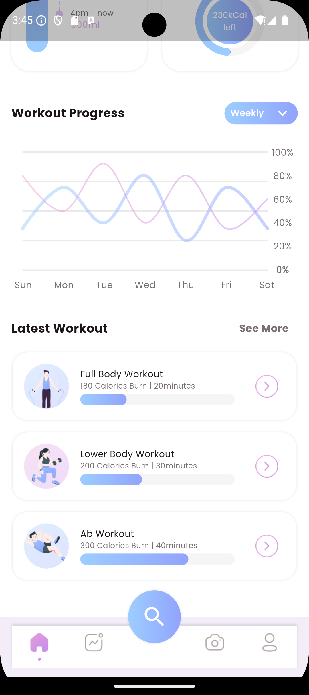
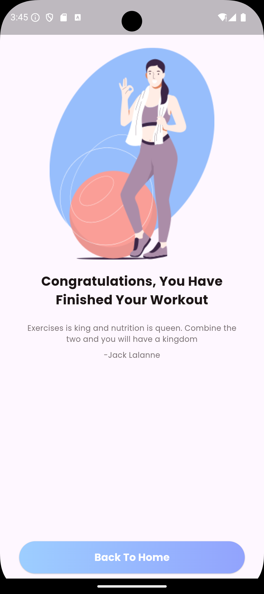
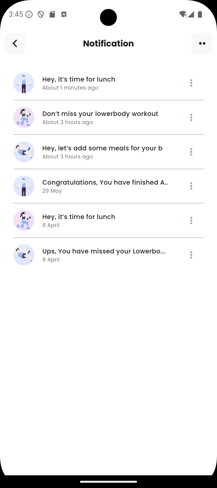
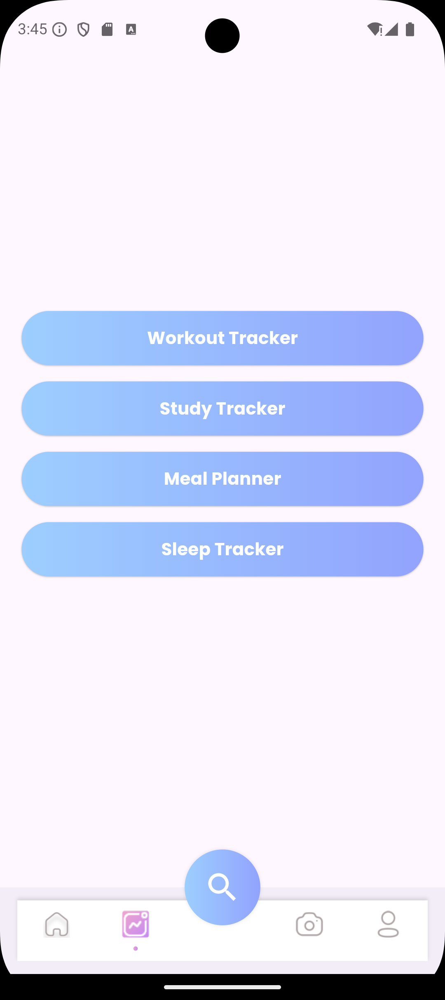
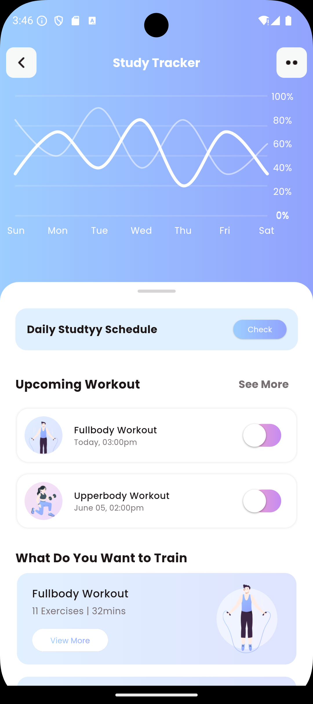
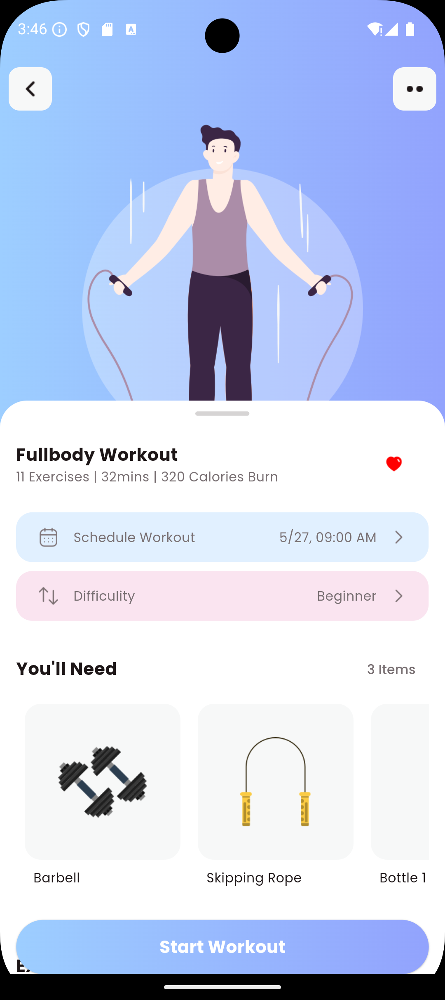
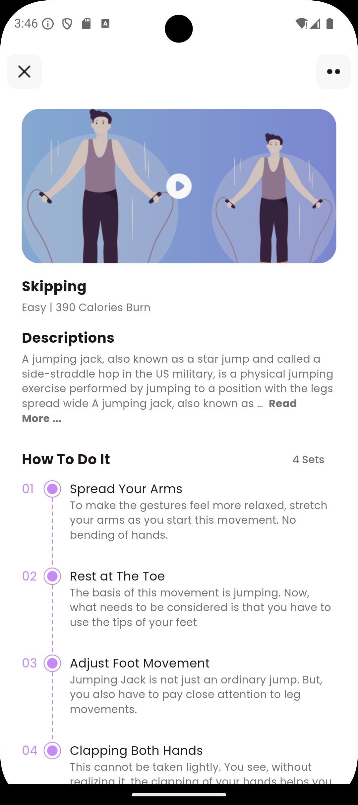
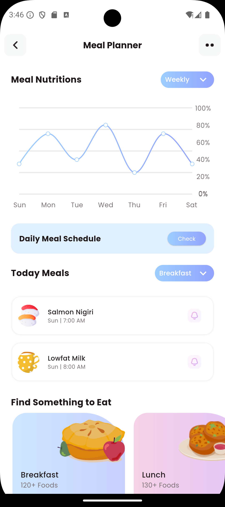
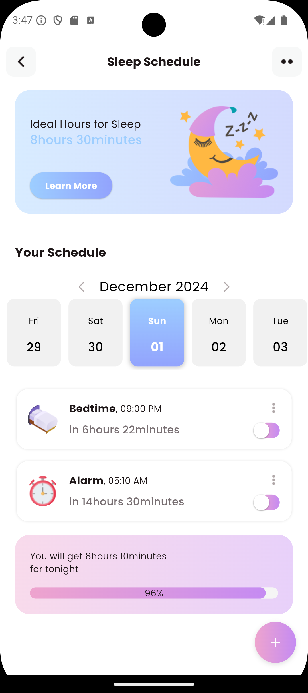
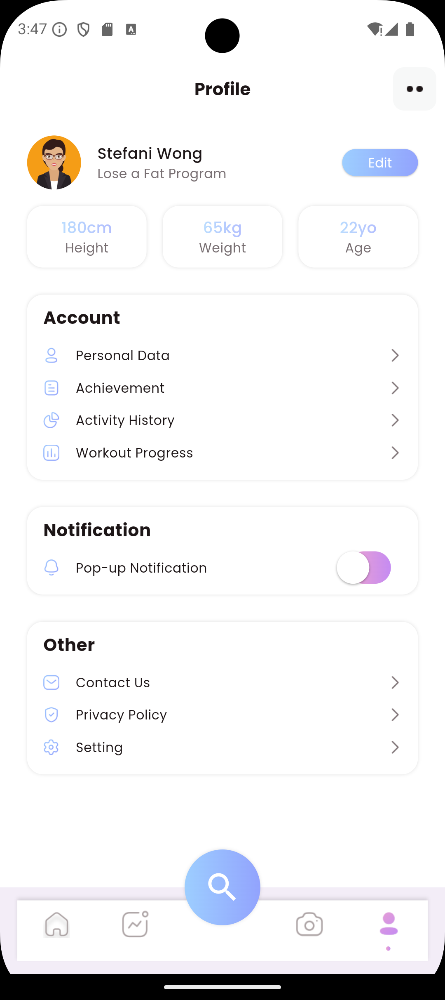

# <p align="center">🏋️‍♂️ HAVitSync App 🥗💤</p>

Welcome to **HAVitSync App**, a modern Flutter application to help you take control of your health and wellness journey. Track workouts, meals, and sleep—all in one beautiful, intuitive interface.

## 📋 Table of Contents
- [Features](#-features)
- [Screenshots](#-screenshots)
- [Links](#-links)
- [Getting Started](#-getting-started)
- [Contributing](#-contributing)

- **Full Body Tracker** 🏋️‍♀️: Track your fitness progress and monitor your workouts effectively.
- **Meal Tracker** 🍎: Keep a log of your meals and ensure a balanced diet.
- **Sleep Tracker** 😴: Monitor your sleep patterns to maintain a healthy lifestyle.

---


## 🚀 Features
- **Stunning UI:** Intuitive and visually appealing design for a seamless experience.
- **All-in-One Tracking:** Manage workouts, meals, and sleep in one place.
- **Cross-Platform:** Built with Flutter for Android, iOS, web, and desktop.
- **Open Source:** Contributions are welcome!

> **Note:** This app currently includes only the UI implementation. Backend and data sync features are planned for future updates.

---


## 📸 Screenshots

Here are some glimpses of the app in action:


<div align="center">
  
  
  
  
  
  
  
  
  
  
  
  
  
  
  
  
  
  
  
  
  
</div>

---


## 🔗 Links
- **GitHub Repository:** [HAVitSync App](https://github.com/AsmitSwain27/HAVitSync_App.git)

---


## 🛠️ Getting Started

To set up and run the app locally:

1. **Clone this repository:**
   ```bash
   git clone https://github.com/AsmitSwain27/HAVitSync_App.git
   ```
2. **Navigate to the project directory:**
   ```bash
   cd HAV_app
   ```
3. **Install dependencies:**
   ```bash
   flutter pub get
   ```
4. **Run the app:**
   ```bash
   flutter run
   ```

---

## 🤝 Contributing

Contributions, issues, and feature requests are welcome! Feel free to check the [issues page](https://github.com/AsmitSwain27/HAVitSync_App/issues) or submit a pull request.

---

_Made with ❤️ using Flutter & Dart._


